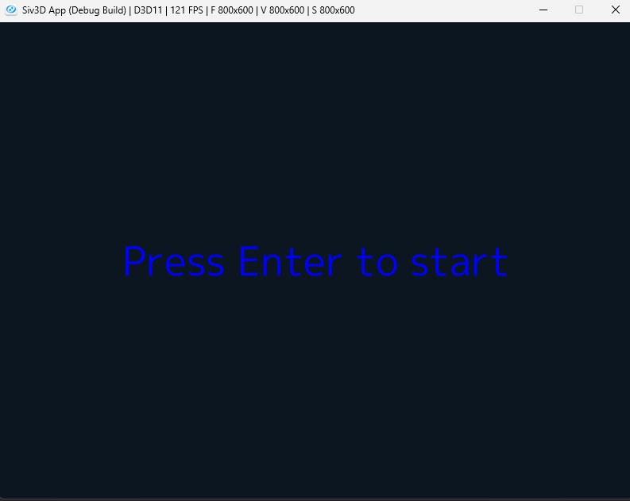
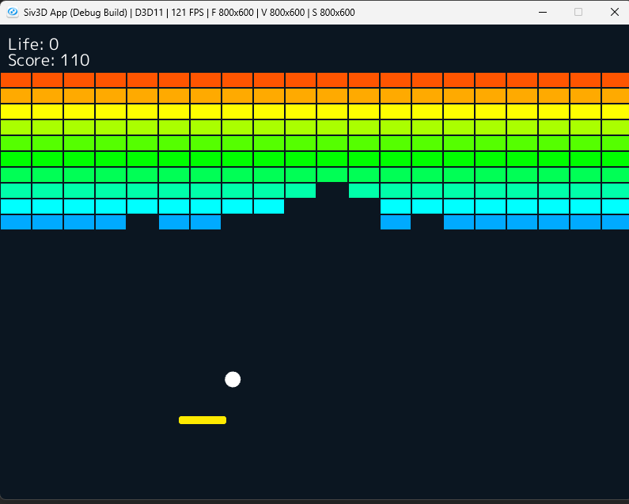
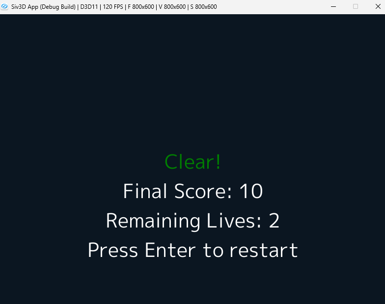

# PA22A_MiyazakiHikaru_2024T1

## ゲームの概要
よくあるブロック崩しゲームです。

## 操作方法

- タイトル画面でエンターキーを押すとゲームが始まります。
- マウスの座標でプレイヤーが移動します。
- ボールが中心から一定の速度で飛んできます。
- プレイヤーがボールに当たるとボールが跳ね返ります。
- ボールが下画面外に出るとゲームオーバーです。
- ブロックにボールが当たるとブロックが消え、スコアが加算されます。
- 全てのブロックを消すとクリアです。
- クリア時間とスコアが表示されます。
- ゲームオーバーまたはクリア後、エンターキーを押すとタイトル画面に戻ります。

## 開発環境
- OpenSiv3D
- Rider