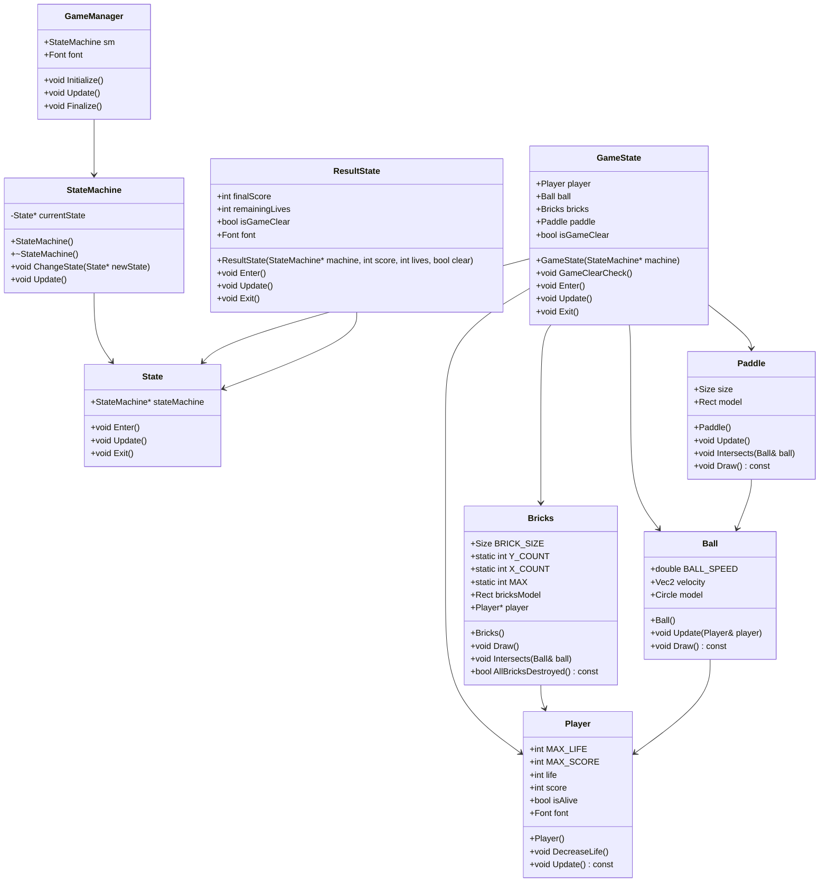

# Breakout Game

## 概要

このプロジェクトは、C++で実装されたシンプルなブロック崩しゲームです。</br>
ゲームは、状態管理(State Machine)とシングルトンパターンを使用して設計されています。

## クラス設計
# Breakout Game Class Diagram




### State

抽象基底クラスで、各ゲーム状態の基盤となります。

#### メンバ変数

- `StateMachine* stateMachine`: 状態を管理するステートマシンへのポインタ。

#### メソッド

- `virtual void Enter() = 0`: 状態に入るときに呼ばれる純粋仮想関数。
- `virtual void Update() = 0`: 毎フレーム呼ばれる純粋仮想関数。
- `virtual void Exit() = 0`: 状態から出るときに呼ばれる純粋仮想関数。

### StateMachine

状態遷移を管理するクラスです。

#### メンバ変数

- `State* currentState`: 現在の状態を保持するポインタ。

#### メソッド

- `StateMachine()`: コンストラクタで初期状態を設定。
- `~StateMachine()`: デストラクタで現在の状態を解放。
- `void ChangeState(State* newState)`: 新しい状態に変更。
- `void Update()`: 現在の状態の`Update`メソッドを呼び出し。

### GameManager

ゲーム全体の管理を行うシングルトンクラスです。

#### メンバ変数

- `StateMachine sm`: 状態管理を行うStateMachineのインスタンス。
- `Font font{ 20 }`: フォントの設定。

#### メソッド

- `void Initialize()`: ゲームの初期化処理を行います。
- `void Update()`: 毎フレーム呼ばれる更新処理を行います。
- `void Finalize()`: ゲームの終了処理を行います。

### Player

プレイヤーの状態を管理するクラスです。

#### メンバ変数

- `int MAX_LIFE = 3`: プレイヤーの最大ライフ。
- `int MAX_SCORE = 0`: プレイヤーの最大スコア。
- `int life`: 現在のライフ。
- `int score`: 現在のスコア。
- `bool isAlive`: プレイヤーが生存しているかどうか。
- `Font font{20}`: フォントの設定。

#### メソッド

- `Player()`: コンストラクタで初期値を設定。
- `void DecreaseLife()`: プレイヤーのライフを減らす。
- `void Update() const`: プレイヤーの状態を更新し、スコアとライフを描画する。

### Ball

ボールの状態を管理するクラスです。

#### メンバ変数

- `double BALL_SPEED = 480.0`: ボールの速度。
- `Vec2 velocity`: ボールの速度ベクトル。
- `Circle model`: ボールの形状を表すサークル。

#### メソッド

- `Ball()`: コンストラクタで初期値を設定。
- `void Update(Player& player)`: ボールの位置と速度を更新する。
- `void Draw() const`: ボールを描画する。

### Paddle

パドルの状態を管理するクラスです。

#### メンバ変数

- `Size size{60, 10}`: パドルのサイズ。
- `Rect model`: パドルの形状を表す矩形。

#### メソッド

- `Paddle()`: コンストラクタで初期化を行う。
- `void Update()`: パドルの位置を更新する。
- `void Intersects(Ball& ball)`: パドルとボールの衝突判定を行う。
- `void Draw() const`: パドルを描画する。

### Bricks

ブロックの状態を管理するクラスです。

#### メンバ変数

- `Size BRICK_SIZE{40, 20}`: ブロックのサイズ。
- `static const int Y_COUNT = 2`: ブロックの縦の数。
- `static const int X_COUNT = 5`: ブロックの横の数。
- `static const int MAX = Y_COUNT * X_COUNT`: ブロックの最大数。
- `Rect bricksModel[MAX]`: 各ブロックの矩形。
- `Player* player`: プレイヤーへのポインタ。

#### メソッド

- `Bricks()`: コンストラクタでブロックを初期化。
- `void Draw()`: ブロックを描画する。
- `void Intersects(Ball& ball)`: ブロックとボールの衝突判定を行う。
- `bool AllBricksDestroyed() const`: 全てのブロックが破壊されたかを判定する。

### GameState

ゲームプレイ中の状態を表現するクラスです。

#### メンバ変数

- `Player player`: プレイヤーのインスタンス。
- `Ball ball`: ボールのインスタンス。
- `Bricks bricks`: ブロックのインスタンス。
- `Paddle paddle`: パドルのインスタンス。
- `bool isGameClear`: ゲームクリア状態を示すフラグ。

#### メソッド

- `GameState(StateMachine* machine)`: コンストラクタで初期化。
- `void GameClearCheck()`: ゲームクリアの判定を行う。
- `void Enter() override`: 状態に入るときに呼ばれるメソッド。
- `void Update() override`: 毎フレーム呼ばれるメソッド。
- `void Exit() override`: 状態から出るときに呼ばれるメソッド。

### ResultState

ゲーム終了後の結果画面の状態を表現するクラスです。

#### メンバ変数

- `int finalScore`: 最終スコア。
- `int remainingLives`: 残りライフ。
- `bool isGameClear`: ゲームクリア状態を示すフラグ。
- `Font font = Font(40)`: フォントの設定。

#### メソッド

- `ResultState(StateMachine* machine, int score, int lives, bool clear)`: コンストラクタで初期化。
- `void Enter() override`: 状態に入るときに呼ばれるメソッド。
- `void Update() override`: 毎フレーム呼ばれるメソッド。
- `void Exit() override`: 状態から出るときに呼ばれるメソッド。

## 実行方法

1. このリポジトリをクローンします。
    ```sh
    git clone https://github.com/yourusername/your-repo-name.git
    ```

2. プロジェクトをビルドします。

3. 実行ファイルを実行します。

## ライセンス

このプロジェクトはMITライセンスの下で公開されています。詳細については、[LICENSE](LICENSE)ファイルを参照してください。
